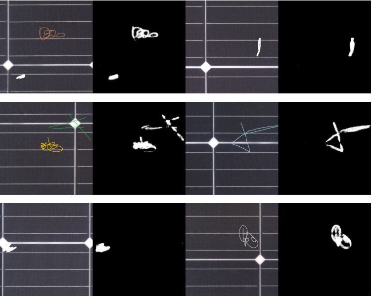
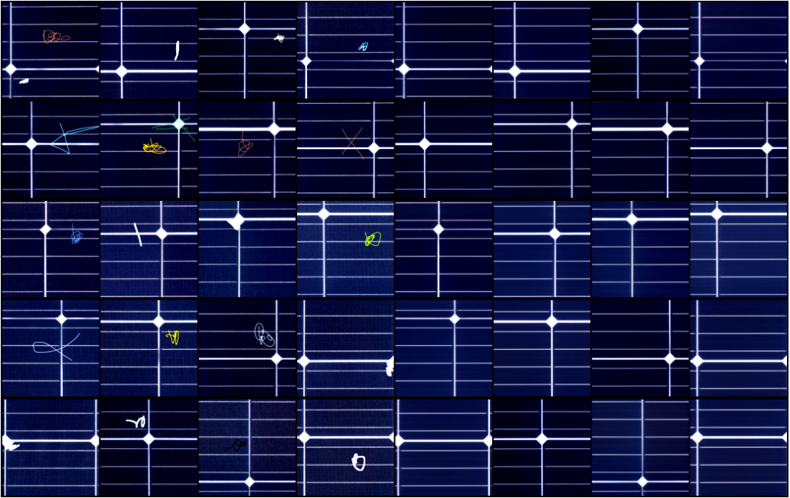
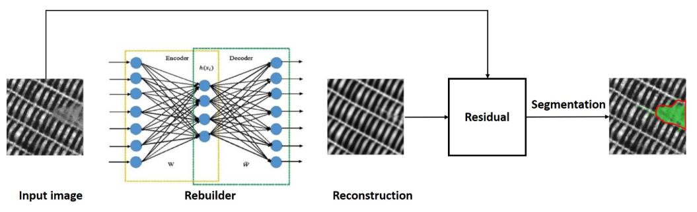
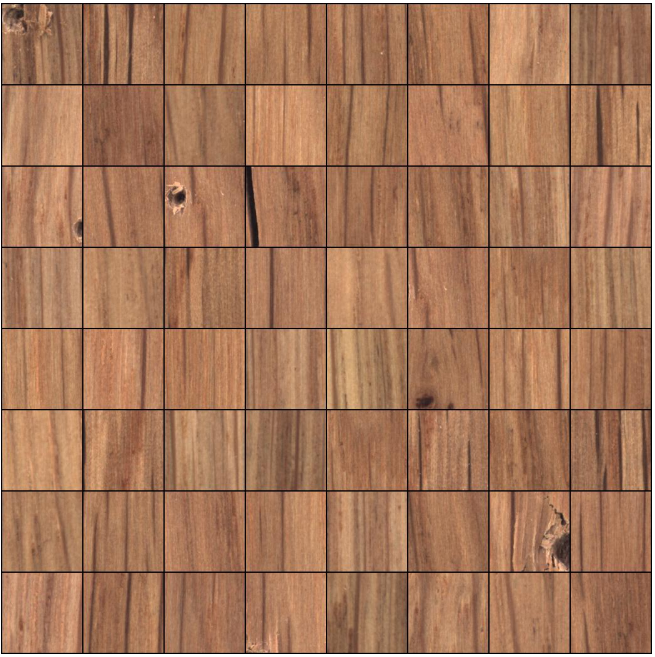
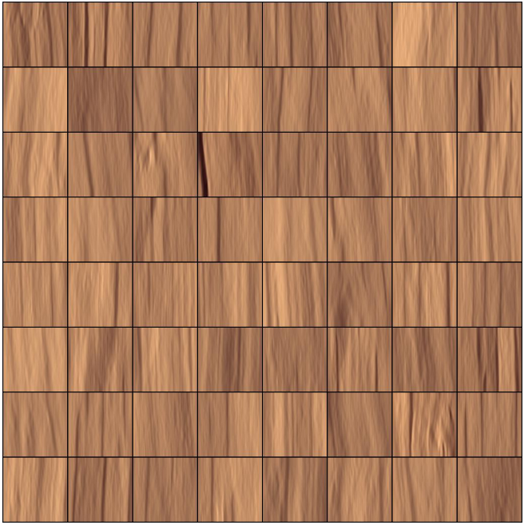
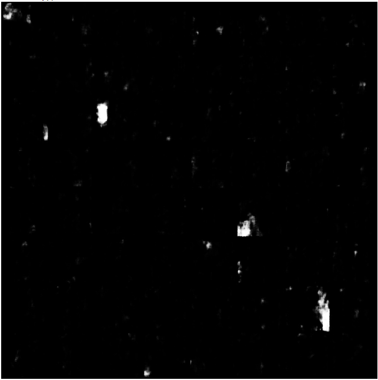

# VAEGAN
try VAE  GANLoss + SSIM loss  in anomaly Detection  

## 基于VAE+GAN的异常图片结果测试如下:

对测试图片以及重建图片进行比对测试结果：

目前 对于光伏外观的异物检测，主要还是基于两部分模型实现：

1、由VAE+GAN 对待测图片进行重建，获得重建后的图片。

2、由待测图片以及重建后的图片，进行异常比对，获得异物定位功能

对于无监督异常图片进行精准的异常区域分割定位，在于如何精准的修复重建，获取语义级别的残差图结果，还需要进一步更深入的探索。

针对上述算法上的一些思考做进一步算法进行探索，打造AnomalyVAEGAN。

## 针对木制纹理结构数据进行探索
主要测试VAE+SSIM loss VAE+SPL loss 以及VAE+GAN loss 验证模型对复杂纹理数据集的重建性能
正常/异常测试数据    

重建后的结果分析    

纹理恢复数据    

